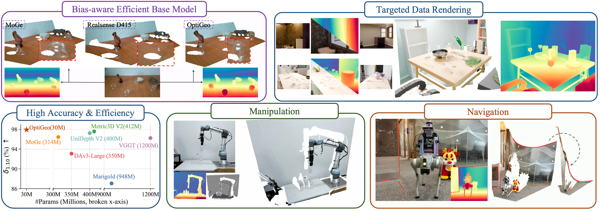
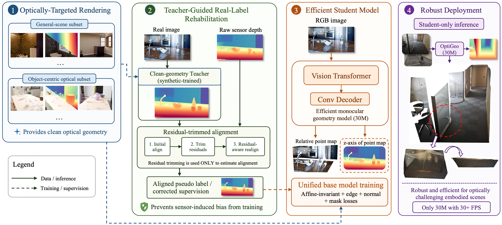
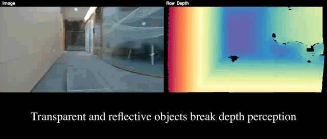

<h1 align="center">OptiGeo: Efficient Monocular Geometry for Embodied Perception in Optically Challenging Scenes</h1>

<p align="center">
  <a href="https://github.com/mx-liu6" target="_blank">Muxin Liu</a><sup>1,2,*</sup>,
  <a href="https://cvmi.hku.hk/wp-content/uploads/cvmi/team.html" target="_blank">Tianbo Liu</a><sup>1,*</sup>,
  <a href="https://github.com/JINGERGER" target="_blank">Jing Xia</a><sup>1,*</sup>,
  <a href="https://shawlyu.github.io" target="_blank">Xiaoyang Lyu</a><sup>1</sup>,
  <a href="https://scholar.google.com/citations?user=9nsSKpsAAAAJ&hl=en" target="_blank">Xiaoshan Wu</a><sup>1</sup>,
  <a href="https://scholar.google.com/citations?user=xgUW0ZEAAAAJ&hl=en" target="_blank">Bo Wang</a><sup>1</sup>,
  <a href="https://daipengwa.github.io" target="_blank">Peng Dai</a><sup>1</sup>,
  <br>
  <a href="https://web.ial-cvmi.com" target="_blank">Zhongrui Wang</a><sup>3</sup>,
  <a href="https://shishaoshuai.com" target="_blank">Shaoshuai Shi</a><sup>2,✉</sup>,
  <a href="https://xjqi.github.io" target="_blank">Xiaojuan Qi</a><sup>1,✉</sup>
</p>

<p align="center">
  <sup>1</sup>The University of Hong Kong &nbsp;&nbsp;
  <sup>2</sup>Voyager Research, Didi Chuxing &nbsp;&nbsp;
  <br> 
  <sup>3</sup>Southern University of Science and Technology
  <br>
  <sup>*</sup>Equal Contribution &nbsp;
  <sup>✉</sup>Corresponding Author
</p>

<p align="center">
  <a href="https://arxiv.org/abs/2608.29881">
    
  </a>
  <a href="https://mx-liu6.github.io/OptiGeo-web/">
    
  </a>
  <a href="https://github.com/mx-liu6/OptiGeo">
    
  </a>
  <a href="https://huggingface.co/mxliu-hku/OptiGeo">
    
  </a>
</p>

<p align="center">
  
</p>

## Overview

OptiGeo redefines transparent and reflective depth estimation as localized bias correction within monocular geometry training, rather than a separate scene-specific depth task.

It rehabilitates biased real-depth supervision with a clean-geometry teacher and residual-trimmed alignment, then uses compact transparency-targeted rendering to learn clean optical geometry. The resulting 30M model is built for accurate, efficient embodied perception in optically challenging scenes.

<p align="center">
  <b>OptiGeo Pipeline</b>
</p>

<p align="center">
  
</p>

<p align="center">
  <b>Demo Video</b>
</p>

<p align="center">
  
</p>

## TODO

- [x] Release paper, project page, pretrained model
- [ ] Release inference code
- [ ] Release training and evaluation code
- [ ] Release OptiGeo dataset and rendering pipeline
- [ ] Release edge computing variants and navigation system setup pipeline

## Installation

```bash
git clone https://github.com/mx-liu6/OptiGeo.git
cd OptiGeo
conda create -n optigeo python=3.10 -y
conda activate optigeo
pip install -r requirements.txt
```

## Pretrained Model

The OptiGeo pretrained model is available on Hugging Face:

| Model | Description | Parameters |
| --- | --- | --- |
| [mxliu-hku/OptiGeo](https://huggingface.co/mxliu-hku/OptiGeo) | Efficient monocular geometry model for optically challenging scenes | 30M |

## Quick Start

The inference code will be released in this repository. After release, the model can be downloaded from Hugging Face and used for monocular geometry prediction on transparent, reflective, and general scenes.

```bash
# Coming soon
```

## Citation

If you find our work useful, please consider citing:

```bibtex
@misc{liu2026optigeo,
      title={OptiGeo: Efficient Monocular Geometry for Embodied Perception in Optically Challenging Scenes}, 
      author={Muxin Liu and Tianbo Liu and Jing Xia and Xiaoyang Lyu and Xiaoshan Wu and Bo Wang and Peng Dai and Zhongrui Wang and Shaoshuai Shi and Xiaojuan Qi},
      year={2026},
      eprint={2608.29881},
      archivePrefix={arXiv},
      primaryClass={cs.CV},
      url={https://arxiv.org/abs/2608.29881}, 
}
```

Please also consider citing our monocular foundation geometry model, FoundationGeo:

```bibtex
@misc{liu2026foundationgeo,
      title={FoundationGeo: Learning Spatial Pixel-Wise Fields for Monocular Metric Geometry}, 
      author={Muxin Liu and Xiaoyang Lyu and Tianhe Ren and Peng Dai and Xiaoshan Wu and Zhiyue Zhang and Jiaqi Zhang and Jiehong Lin and Shaoshuai Shi and Xiaojuan Qi},
      year={2026},
      eprint={2607.11588},
      archivePrefix={arXiv},
      primaryClass={cs.CV},
      url={https://arxiv.org/abs/2607.11588}, 
}
```

## Links

- [Paper](https://arxiv.org/abs/2608.29881)
- [Project Page](https://mx-liu6.github.io/OptiGeo-web/)
- [Code](https://github.com/mx-liu6/OptiGeo)
- [Hugging Face](https://huggingface.co/mxliu-hku/OptiGeo)

## License

This project is licensed under the MIT License.

## Acknowledgments

We thank the MoGe series of works and the DINO series of works.
