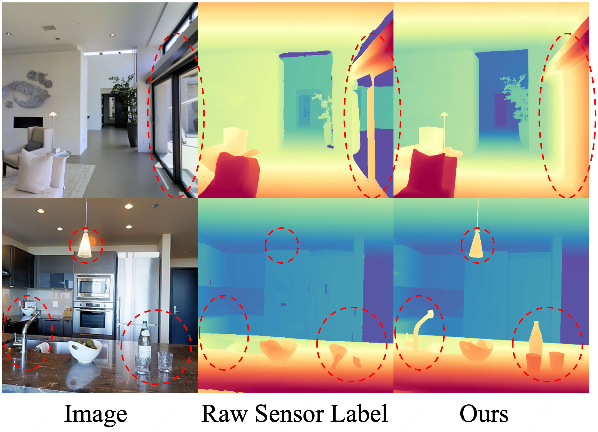

<h1 align="center">OptiGeo: Efficient Monocular Geometry for Embodied Perception in Optically Challenging Scenes</h1>

<p align="center">
  <a href="https://github.com/mx-liu6" target="_blank">Muxin Liu</a><sup>1,2,*</sup>,
  <a href="https://cvmi.hku.hk/wp-content/uploads/cvmi/team.html" target="_blank">Tianbo Liu</a><sup>1,*</sup>,
  <a href="https://github.com/JINGERGER" target="_blank">Jing Xia</a><sup>1,*</sup>,
  <a href="https://shawlyu.github.io" target="_blank">Xiaoyang Lyu</a><sup>1</sup>,
  <a href="https://scholar.google.com/citations?user=9nsSKpsAAAAJ&hl=en" target="_blank">Xiaoshan Wu</a><sup>1</sup>,
  <a href="https://scholar.google.com/citations?user=xgUW0ZEAAAAJ&hl=en" target="_blank">Bo Wang</a><sup>1</sup>,
  <a href="https://daipengwa.github.io" target="_blank">Peng Dai</a><sup>1</sup>,
  <br>
  <a href="https://web.ial-cvmi.com" target="_blank">Zhongrui Wang</a><sup>3</sup>,
  <a href="https://shishaoshuai.com" target="_blank">Shaoshuai Shi</a><sup>2,✉</sup>,
  <a href="https://xjqi.github.io" target="_blank">Xiaojuan Qi</a><sup>1,✉</sup>
</p>

<p align="center">
  <sup>1</sup>The University of Hong Kong &nbsp;&nbsp;
  <sup>2</sup>Voyager Research, Didi Chuxing &nbsp;&nbsp;
  <br> 
  <sup>3</sup>Southern University of Science and Technology
  <br>
  <sup>*</sup>Equal Contribution &nbsp;
  <sup>✉</sup>Corresponding Author
</p>

<p align="center">
  <a href="https://arxiv.org/abs/2608.29881">
    
  </a>
  <a href="https://mx-liu6.github.io/OptiGeo-web/">
    
  </a>
  <a href="https://github.com/mx-liu6/OptiGeo">
    
  </a>
  <a href="https://huggingface.co/mxliu-hku/OptiGeo">
    
  </a>
</p>

<p align="left">
  This work presents OptiGeo, which redefines transparent and reflective depth estimation as localized bias correction within monocular geometry training.
</p>

<p align="left">
  · 🧭 Rehabilitates biased real-depth supervision with a clean-geometry teacher and residual-trimmed alignment.<br>
  · ⚡ Delivers a 30M model for accurate and efficient embodied perception in optically challenging scenes.
</p>

<p align="center">
  
</p>

<p align="center">
  
</p>

## Release Status

- [x] Release paper and project page
- [x] Release pretrained OptiGeo model
- [x] Release inference, web demo, evaluation, and training code
- [x] Release training and evaluation configuration files
- [ ] Release OptiGeo dataset and rendering pipeline
- [ ] Release edge computing variants and navigation system setup pipeline

## ⚙️ Installation

```bash
git clone https://github.com/mx-liu6/OptiGeo.git
cd OptiGeo
conda create -n optigeo python=3.10 -y
conda activate optigeo
pip install -r requirements.txt
```

For editable local development, install the package as well:

```bash
pip install -e .
```

If you install PyTorch manually, choose the build that matches your CUDA version from the official PyTorch instructions before running `pip install -r requirements.txt`.

## 📦 Pretrained Model

The OptiGeo pretrained model is available on Hugging Face:

| Model | Description | Parameters |
| --- | --- | --- |
| [mxliu-hku/OptiGeo](https://huggingface.co/mxliu-hku/OptiGeo) | Efficient monocular geometry model for optically challenging scenes | 30M |

The model is downloaded automatically from Hugging Face when `--pretrained` is omitted or set to `mxliu-hku/OptiGeo`.

## 🚀 Quick Start

```bash
# Run inference on one image or a folder of images
python optigeo/scripts/infer.py \
  --input path/to/image_or_folder \
  --output output/optigeo \
  --pretrained mxliu-hku/OptiGeo \
  --device cuda \
  --maps \
  --ply \
  --glb
```

Outputs are saved under `output/optigeo` and can include:

- `image.jpg`: resized input image used by inference
- `depth.exr` and `depth_vis.png`: metric depth and visualization
- `points.exr`: metric point map
- `mask.png`: valid prediction mask
- `fov.json`: estimated camera field of view
- `pointcloud.ply` and `mesh.glb`: 3D exports

Useful options:

```bash
# Faster inference with half precision
python optigeo/scripts/infer.py -i path/to/images -o output/fast --fp16 --maps

# Control inference resolution; higher is sharper but slower
python optigeo/scripts/infer.py -i path/to/images -o output/high --resolution_level 9 --maps

# Use a known horizontal camera field of view in degrees
python optigeo/scripts/infer.py -i path/to/image.jpg -o output/fov --fov_x 70 --maps
```

## 🖥️ Web Demo

Launch the Gradio demo locally:

```bash
python optigeo/scripts/app.py --pretrained mxliu-hku/OptiGeo --fp16
```

To create a public Gradio sharing link:

```bash
python optigeo/scripts/app.py --pretrained mxliu-hku/OptiGeo --fp16 --share
```

## 🌐 Panorama Inference

For equirectangular panorama images:

```bash
python optigeo/scripts/infer_panorama.py \
  --input path/to/panorama_or_folder \
  --output output/panorama \
  --pretrained mxliu-hku/OptiGeo \
  --maps \
  --ply \
  --glb
```

## 📏 Evaluation

We provide a unified evaluation pipeline that wraps a baseline model, evaluates it on configured benchmarks, and writes metrics to a JSON file.

### Benchmarks

Download the processed evaluation datasets from [Hugging Face Datasets](https://huggingface.co/datasets/Ruicheng/monocular-geometry-evaluation) and place them under `data/eval`:

```bash
mkdir -p data/eval
huggingface-cli download Ruicheng/monocular-geometry-evaluation \
  --repo-type dataset \
  --local-dir data/eval \
  --local-dir-use-symlinks False
```

Then unzip the benchmark files:

```bash
cd data/eval
unzip '*.zip'
cd ../..
```

### Run Evaluation

```bash
python optigeo/scripts/eval_baseline.py \
  --baseline baselines/optigeo.py \
  --config configs/eval/all_benchmarks.json \
  --output eval_output/optigeo.json \
  --pretrained mxliu-hku/OptiGeo \
  --resolution_level 9
```

Useful evaluation options include `--oracle` for GT intrinsics, `--dump_pred` for prediction dumps, and `--dump_gt` for ground-truth dumps. To evaluate a customized method, implement the interface in [`optigeo/test/baseline.py`](optigeo/test/baseline.py); see [`baselines/optigeo.py`](baselines/optigeo.py) for an example.

More details are available in [`docs/eval.md`](docs/eval.md).

## 🏋️ Training

We provide training code and configuration files:

- OptiGeo-S: [`configs/train/OptiGeo.json`](configs/train/OptiGeo.json)
- OptiGeo-H+: [`configs/train/OptiGeo_Hplus_w_refine.json`](configs/train/OptiGeo_Hplus_w_refine.json)
- OptiGeo-L: [`configs/train/OptiGeo_Large_w_refine.json`](configs/train/OptiGeo_Large_w_refine.json)
- Multi-GPU launch script: [`scripts/train.sh`](scripts/train.sh)

### Data Preparation

Training datasets are expected under `data/train`. Each dataset should contain an index file and per-sample folders:

```text
data/train/somedataset
├── index.txt
├── sample_000001
│   ├── image.jpg
│   ├── depth.png
│   └── meta.json
└── ...
```

`index.txt` stores one sample folder per line. `meta.json` should include normalized camera intrinsics:

```json
{
  "intrinsics": [[fx, 0.0, cx], [0.0, fy, cy], [0.0, 0.0, 1.0]]
}
```

Depth maps can be read and written with the helpers in [`optigeo/utils/io.py`](optigeo/utils/io.py). You can inspect prepared samples with:

```bash
python optigeo/scripts/vis_data.py data/train/somedataset/sample_000001 --ply
```

### Run Training

For a single-machine launch, call `accelerate` directly and adjust `--num_processes`, batch size, workspace, and checkpoint path as needed:

```bash
accelerate launch --multi_gpu --num_processes 8 \
  optigeo/scripts/train.py \
  --config configs/train/OptiGeo.json \
  --workspace workspace/OptiGeo \
  --gradient_accumulation_steps 1 \
  --batch_size_forward 16 \
  --checkpoint latest \
  --enable_gradient_checkpointing False \
  --enable_mlflow True
```

The provided launch script is designed for multi-GPU or multi-node training environments. It reads distributed settings from environment variables such as `RESOURCE_NUM_GPU`, `DISTRIBUTED_NODE_COUNT`, `DISTRIBUTED_NODE_RANK`, and `DISTRIBUTED_MASTER_HOSTS`:

```bash
bash scripts/train.sh
```

More details are available in [`docs/train.md`](docs/train.md).

## 🏗️ Architecture


## 📊 Results



## Citation

If you find our work useful, please consider citing:

```bibtex
@misc{liu2026optigeo,
      title={OptiGeo: Efficient Monocular Geometry for Embodied Perception in Optically Challenging Scenes}, 
      author={Muxin Liu and Tianbo Liu and Jing Xia and Xiaoyang Lyu and Xiaoshan Wu and Bo Wang and Peng Dai and Zhongrui Wang and Shaoshuai Shi and Xiaojuan Qi},
      year={2026},
      eprint={2608.29881},
      archivePrefix={arXiv},
      primaryClass={cs.CV},
      url={https://arxiv.org/abs/2608.29881}, 
}
```

Please also consider citing our monocular foundation geometry model, FoundationGeo:

```bibtex
@misc{liu2026foundationgeo,
      title={FoundationGeo: Learning Spatial Pixel-Wise Fields for Monocular Metric Geometry}, 
      author={Muxin Liu and Xiaoyang Lyu and Tianhe Ren and Peng Dai and Xiaoshan Wu and Zhiyue Zhang and Jiaqi Zhang and Jiehong Lin and Shaoshuai Shi and Xiaojuan Qi},
      year={2026},
      eprint={2607.11588},
      archivePrefix={arXiv},
      primaryClass={cs.CV},
      url={https://arxiv.org/abs/2607.11588}, 
}
```

## Links

- [Paper](https://arxiv.org/abs/2608.29881)
- [Project Page](https://mx-liu6.github.io/OptiGeo-web/)
- [Code](https://github.com/mx-liu6/OptiGeo)
- [Hugging Face](https://huggingface.co/mxliu-hku/OptiGeo)

## 📄 License

OptiGeo original code and documentation are released under the MIT License. Third-party components retain their original license terms; see [`THIRD_PARTY_NOTICES.md`](THIRD_PARTY_NOTICES.md) and the source-file headers for details.

## 🙏 Acknowledgments

We thank the MoGe series of works and DINOv3.
